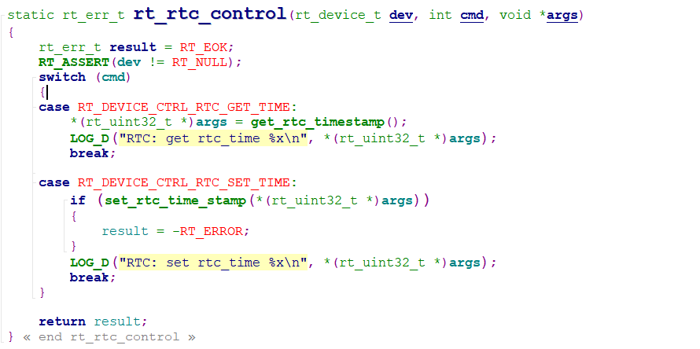

## 说明
RT-Thread提供RTC设备管理接口来访问RTC，接口文件rtc.c位于`rt-thread-master\rt-thread\components\drivers\rtc`目录下，相关接口如下所示：
|      **函数**    |        **描述** |
|        :--       |        :--      |
|    set_date()    | 设置日期，年、月、日 |
|    set_time()    | 设置时间、时、分、秒 |
|    time()        | 获取当前时间        |

## 流程分析
在`rtconfig.h`文件中要支持宏定义**RT_USING_RTC**。RT-Thread还提供了硬件驱动函数drv_rtc.c，用于RTC的初始化、配置等操作。

#### RTC初始化
在drv_rtc.c中初始化流程为rt_hw_rtc_init() -> rt_hw_rtc_register() -> rt_rtc_init()，该函数用于配置RTC时钟。然后调用rt_rtc_config()函数用于配置RTC参数。然后就是RTC的控制函数`rt_rtc_control()`函数，用于设置 或 查询RTC时间。

`rt_rtc_control()`函数作为rtc设备驱动的*control*方法，实际上前面的set_date() 和 set_time()函数最终也是通过调用该方法来实现对RTC设备的操作。

> RTC还支持Finish命令，输入`date`即可查看当前时间；同样使用`date`命令，在后面依次输入年 月 日 时 分 秒，就可以设置RTC时钟；